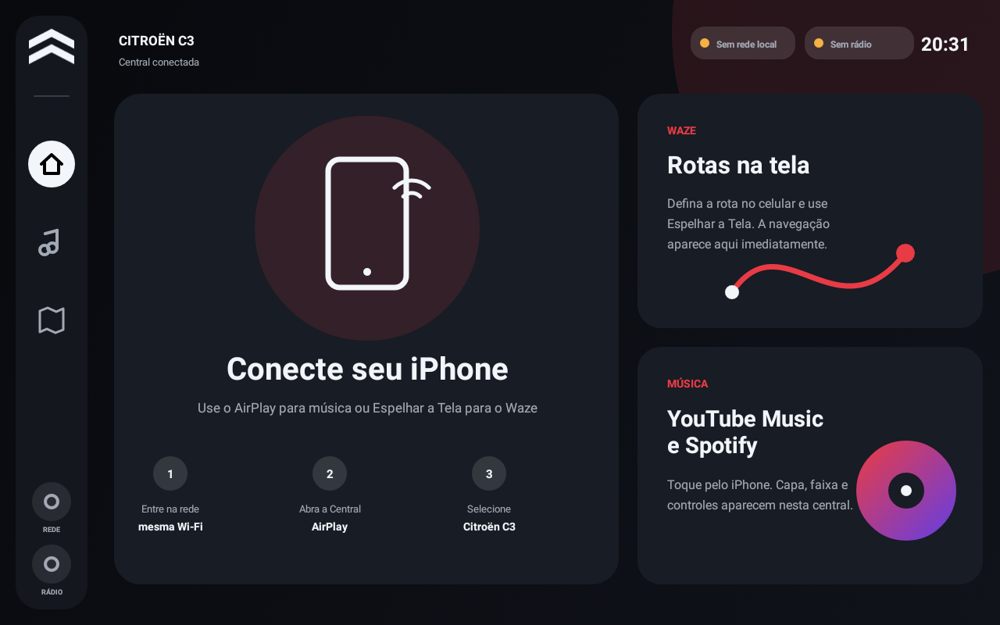
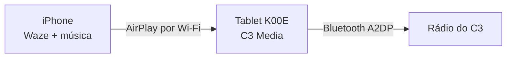

# C3 Media

Central multimídia feita para o **ASUS K00E / Fonepad 7**, com Android 5.0 (API 21), processador Intel x86 e tela 1280×800. O aplicativo transforma o tablet em um receptor AirPlay para uso no Citroën C3 sem dongle CarPlay.



## O que já funciona

- YouTube Music, Spotify, Apple Music e demais áudios reproduzidos no iPhone via AirPlay;
- áudio recebido no tablet e encaminhado pelo Android ao rádio conectado por Bluetooth A2DP;
- título, artista, álbum, capa, duração e controles quando o iPhone envia os metadados;
- espelhamento do iPhone para exibir o Waze e qualquer rota definida no celular;
- rotação automática de telas verticais e ajuste proporcional sem esticar a imagem;
- painel modular com Waze à esquerda e música/controles em um card lateral;
- liberação segura do decodificador ao alternar Waze e YouTube/YouTube Music;
- espera automática, proteção térmica, monitor de bateria/memória e recuperação de falhas;
- tela de abertura Citroën, modo paisagem, interface 1280×800, fontes e áreas de toque ampliadas;
- abertura no boot, opção de launcher padrão e modo quiosque;
- ponto de acesso local `Citroen-C3`, com fallback para uma rede Wi-Fi compartilhada;
- menu técnico protegido por PIN para Bluetooth e rede.

## Fluxo de uso



O iPhone continua sendo o aparelho onde YouTube Music e Waze rodam. Isso evita depender de versões antigas e incompatíveis desses aplicativos no Android 5. Para música, selecione **Citroën C3** como saída AirPlay. Para o Waze, selecione **Citroën C3** em *Espelhar a Tela*.

## Instalação

O APK pronto fica em [`release/C3-Media-1.2.0-K00E.apk`](release/C3-Media-1.2.0-K00E.apk). O passo a passo completo está em [`docs/INSTALLATION.md`](docs/INSTALLATION.md).

## Compatibilidade alvo

| Item | Alvo validado |
| --- | --- |
| Modelo | ASUS K00E / Fonepad 7 |
| Android | 5.0 / API 21 |
| CPU | Intel x86 / i386 |
| Tela | 1280×800, paisagem |
| Firmware informado | `LRX21V.WW_epad-V7.6.0-20151125` |
| Kernel informado | `3.10.20-i386_ctp` |

Este APK contém somente bibliotecas x86 de 32 bits de propósito: é uma versão específica para o tablet do projeto, não para publicação na Play Store.

## Build

Pré-requisitos: JDK 17, Android SDK 36, Android SDK Platform 21, Build Tools 35+, CMake e NDK `27.0.12077973`.

```bash
git submodule update --init --recursive
./gradlew testDebugUnitTest assembleDebug lintDebug
```

O APK sai em `app/build/outputs/apk/debug/app-debug.apk`.

## Estado e continuidade

Leia [`docs/CONTINUITY.md`](docs/CONTINUITY.md) antes de continuar o desenvolvimento. O arquivo registra arquitetura, decisões, correções de Android 5, testes executados e os testes físicos ainda necessários.

## Limitações honestas

- Não é CarPlay e não usa autenticação MFi; é um receptor AirPlay com interface automotiva.
- iOS não permite ao APK iniciar sozinho o espelhamento. Na primeira utilização normalmente é preciso escolher **Citroën C3** na Central de Controle; o iPhone pode sugerir destinos usados com frequência.
- O toque do tablet não controla o Waze do iPhone. A rota é definida no celular e aparece no tablet por espelhamento.
- Sem um receptor CarPlay, o iOS interrompe a imagem do Waze quando ele vai para segundo plano ou quando a tela do iPhone é apagada. Os controles e metadados de música continuam disponíveis quando enviados pelo AirPlay.
- O aplicativo reduz a carga e monitora a temperatura, mas Android 5/ASUS não oferece uma API segura para limitar fisicamente a carga da bateria; a ventilação e a alimentação regulada continuam obrigatórias.
- Para manter os dados móveis durante o AirPlay, a rede `Citroen-C3` deve ser configurada uma vez no iPhone com IP manual e sem roteador; veja o guia de instalação.
- O ponto de acesso automático usa a API do Android 5 e pode variar conforme o firmware ASUS; há acesso manual pelo menu técnico.
- A etapa final exige teste real com o iPhone, o Bluetooth do rádio e este K00E.

## Base e licença

Projeto derivado de [jqssun/android-airplay-server](https://github.com/jqssun/android-airplay-server), que integra [UxPlay](https://github.com/FDH2/UxPlay), FFmpeg, OpenSSL, libplist e Oboe. O código permanece sob **GPL-3.0**; consulte [`LICENSE`](LICENSE). Não há vínculo com Apple, Citroën, Google, Spotify ou ASUS.
